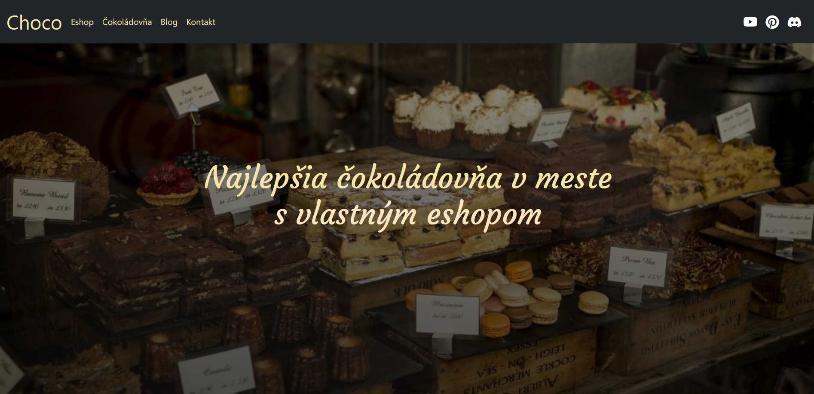
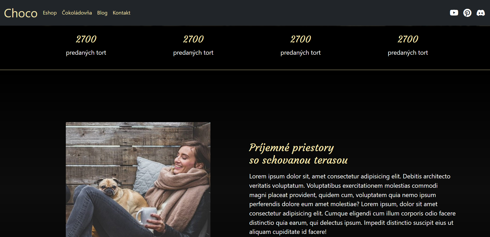
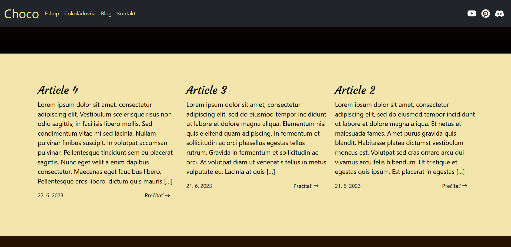
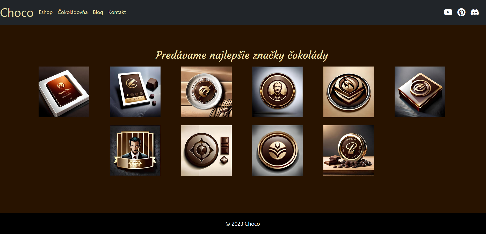
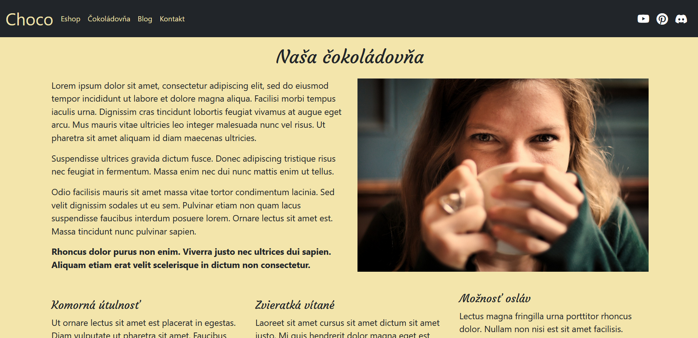
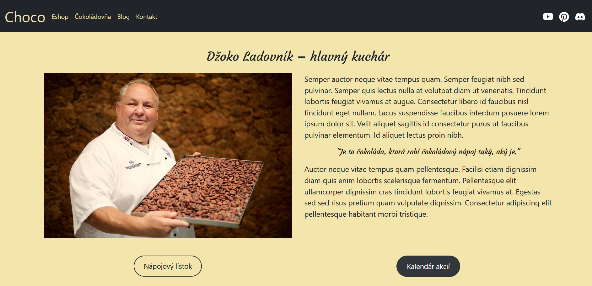
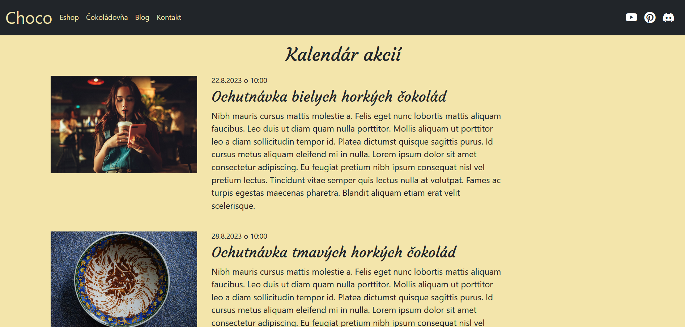

Wordpress project s vlastnou témou Choco

- v súboru db je exportovaný súbor pre rozbehanie
- web je nastavený na lokálnu doménu choco.local

#Images of website

1) Frontpage - magnet (hneď po načítaní stránky)

2) Frontpage - section

3) Frontpage - posledné 3 články, farba pozadia stránky, výzor blogu 

4) Frontpage - sekcia značky, tie vygenerovalo BlueWillow (AI)

5) Stránka Čokoládovňa 1

6) Stránka Čokoládovňa 2 - šéfkuchár

7) Stránka Kalendár akcií

